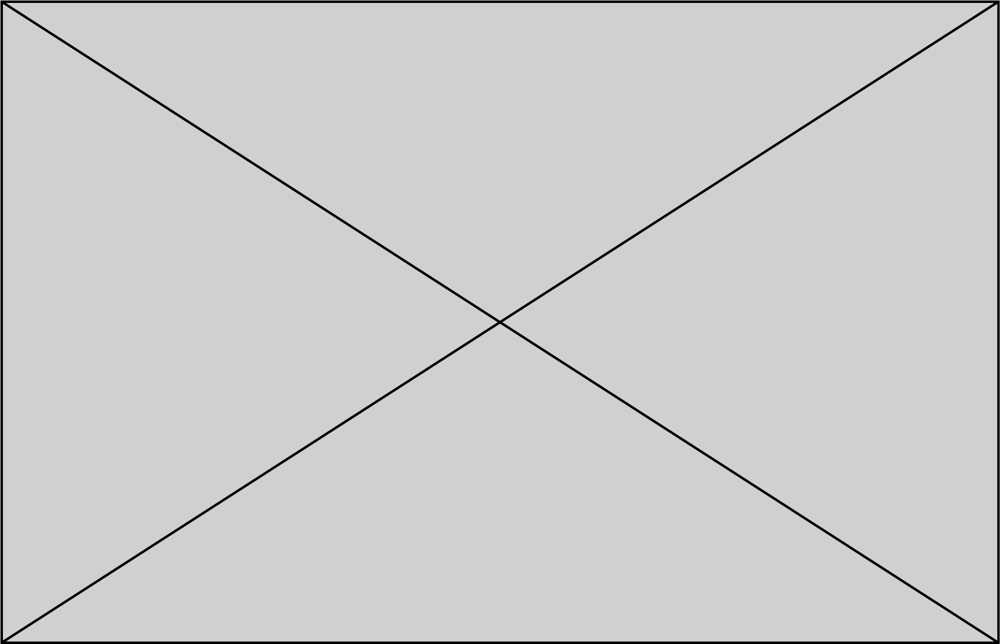

.. title:: Home

|

The **<device>** is <add description here>.

.. raw:: html

     

    

        <a class="reference internal" href="About/example1.html">
        

            
            

                <h5 class="card-title">Topic 1</h5>
                
Description of topic.

            

        

        <a class="reference internal" href="About/example2.html">
        

            
            

                <h5 class="card-title">Topic 2</h5>
                
Description of topic.

            

        

        <a class="reference internal" href="About/index.html">
        

            
            

                <h5 class="card-title">Topic 3</h5>
                
Description of topic.

            

        

        <a class="reference external" href="https://github.com/open-ephys" target="_blank" rel="noopener noreferrer">
        

            
            

                <h5 class="card-title">Topic 4</h5>
                
This is an external link.

            

        

    

.. toctree::
    :hidden:
    :maxdepth: 2
    :titlesonly:

    About/index